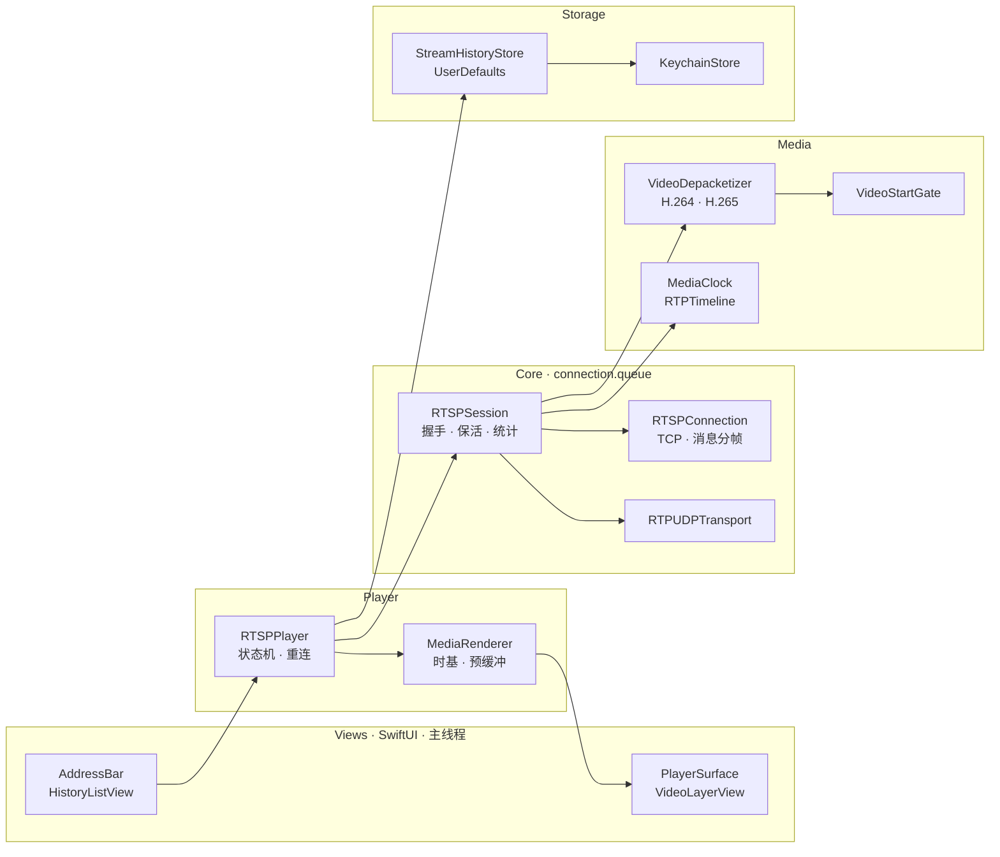
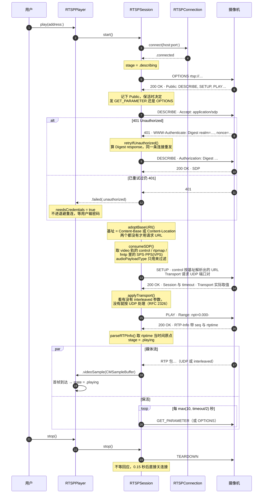
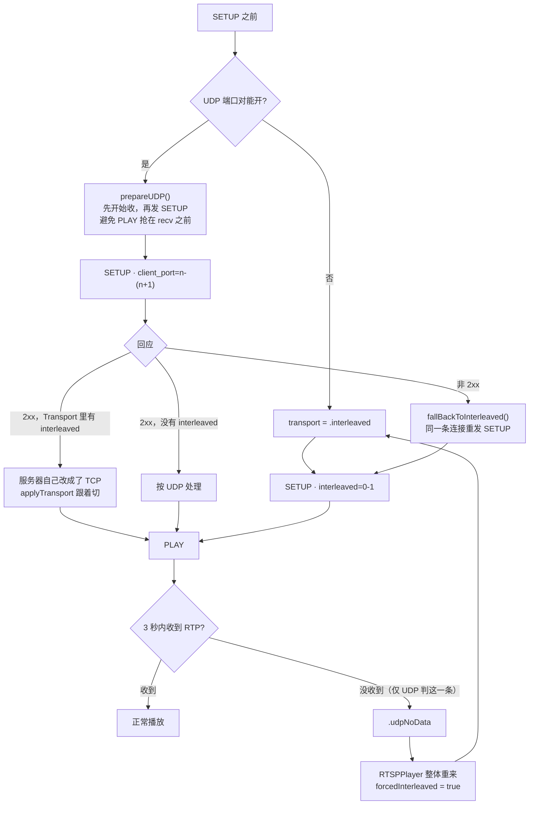
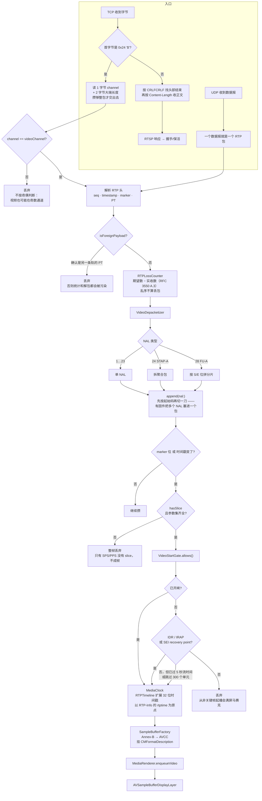
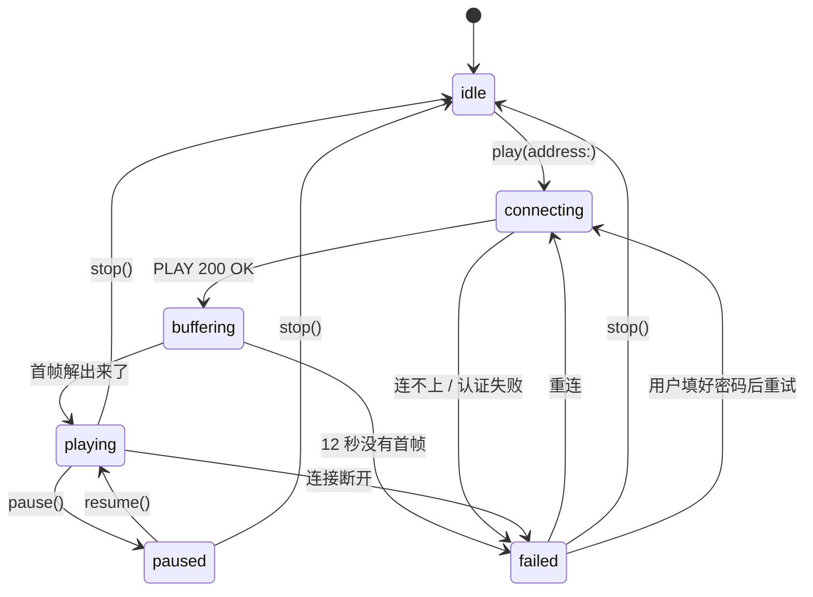
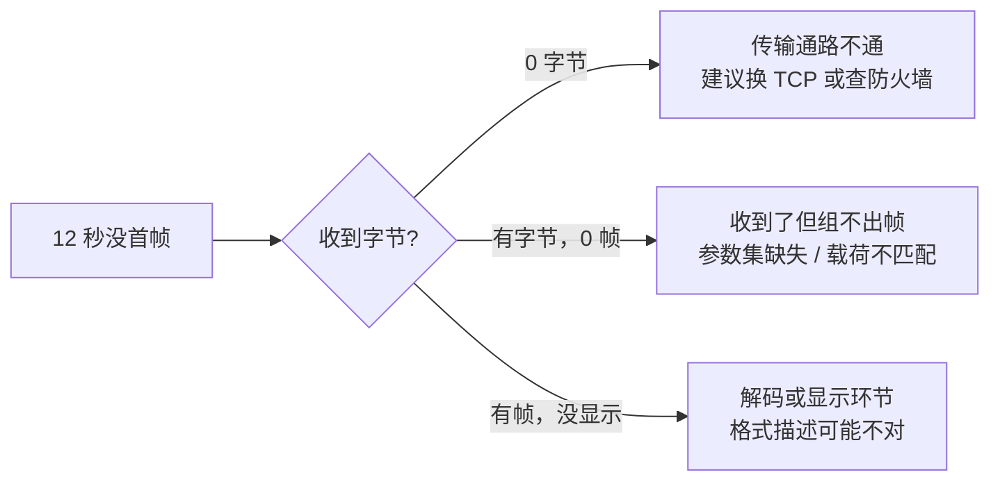
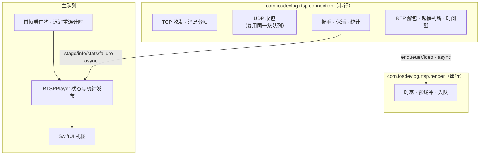
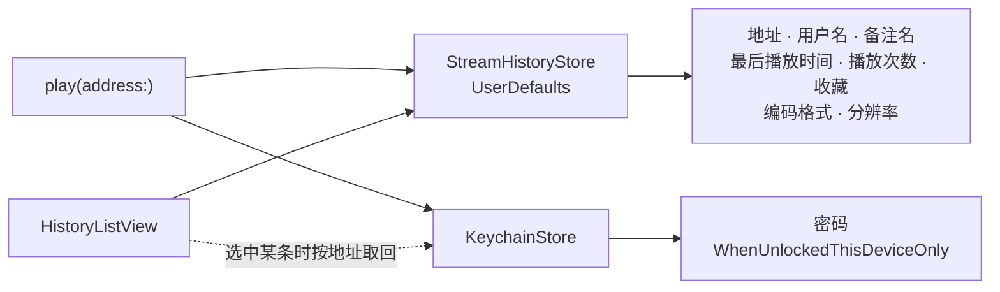

# RTSP 工作流程

这个客户端不依赖第三方库：RTSP 信令、RTP 解包、参数集组装全部自己实现，
解码和显示交给系统的 VideoToolbox 与 `AVSampleBufferDisplayLayer`。

下面的每张图都对着代码画的，文件名和行为都可以直接去源码里核对。

## 总览

四层，各自的队列不同 —— 这一点在「线程模型」一节单独说。



## 一、握手时序

主干在 `RTSPSession+Handshake.swift`。四个方法按顺序发，每一步的回应决定下一步。



图里的头部写成了叙述，因为 Mermaid 会把 `;` 当语句分隔符。实际收发的原文是
这样（`SETUP` 的 URL 由 SDP 里 video 轨的 `a=control:` 按基址解析而来）：

```http
SETUP rtsp://192.168.0.1/livestream/1/trackID=0 RTSP/1.0
Transport: RTP/AVP;unicast;client_port=5000-5001

RTSP/1.0 200 OK
Session: 12345678;timeout=60
Transport: RTP/AVP;unicast;client_port=5000-5001

RTSP/1.0 200 OK
RTP-Info: url=rtsp://192.168.0.1/livestream/1/trackID=0;seq=8123;rtptime=3092385
```

### control 要按基址解析，不是按请求 URL

SDP 里的 `a=control:` 多半是相对值。它相对的是 **DESCRIBE 应答定下的基址**，
按 RFC 2326 取 `Content-Base` → `Content-Location` → 请求 URL，先到先用。

不少设备三者一致，于是「按请求 URL 拼」看起来一直是对的。那台行车记录仪
（LIVE555）就不是 —— 抓包里 VLC 和它的对话是这样的：

```http
DESCRIBE rtsp://192.168.1.254:554/xxx.mov RTSP/1.0

RTSP/1.0 200 OK
Content-Base: rtsp://192.168.1.254/00000000/

a=control:*
a=control:track1

SETUP rtsp://192.168.1.254/00000000/track1 RTSP/1.0
PLAY rtsp://192.168.1.254/00000000/ RTSP/1.0
```

路径从 `/xxx.mov` 换成了 `/00000000/`，端口也不见了。按请求 URL 拼会发出
`rtsp://192.168.1.254:554/xxx.mov/track1`，真机回 404。

几条实现上的取舍：

- **拼接是「基址后面接一段」，不是 RFC 3986 那套「替换最后一段」。**
  RTSP 服务器（含 LIVE555 自己）实际就是这么拼的，按 3986 严格解析反而对不上。
- **只认绝对的 `Content-Base`。** 拿它当基址的目的就是换掉请求 URL 的路径，
  相对值给不了这个。不合格的值当没有这个头。
- **基址只是字符串，客户端不照它重新拨号。** 连接在 DESCRIBE 之前就建好了。
  记录仪给的基址不带端口，要是照它拨号会去连 554 而不是原来的端口。
- **会话级 `a=control:` 是绝对地址时，它就是 PLAY / 保活 / TEARDOWN 的
  目标**；是 `*` 或没有，这些就发给基址本身。

对照代码：`RTSPURL.resolveControl(_:base:)`、
`RTSPSession+Handshake.adoptBaseURI(from:sdp:)`。
`Tests/matrix.sh` 里 `dashcam` 是正例，`ctl_nobase` 是把 `Content-Base`
扣掉的对照 —— **它报 404 才说明这条路真的在被验**。

## 二、传输协商：先 UDP，再退 TCP

UDP 延迟低，但常被 NAT 和防火墙挡掉，而且不少摄像机嘴上答应 UDP、
实际一个包都不发。所以这里有两道退路：SETUP 当场失败退一次，
PLAY 之后三秒没数据再整体退一次。



判断服务器给的是哪种传输，只能看有没有 `interleaved` 参数，
**不能去找字面的 "UDP"**。RFC 2326 里 `RTP/AVP;unicast;client_port=…`
本身就是 UDP，头部不会出现 "UDP" 这个词。早先按关键字找的写法在真机上
一律误判成 TCP。

| 收到的 Transport | 判定 | 依据 |
| --- | --- | --- |
| `RTP/AVP;unicast;client_port=5000-5001` | UDP | 没有 interleaved |
| `RTP/AVP/UDP;unicast;server_port=…` | UDP | 同上 |
| `RTP/AVP/TCP;unicast;interleaved=0-1` | TCP | 有 interleaved |

SETUP 的回应里 `server_port` 和 `source` 都可能缺。所以 UDP socket 不做
`connect()`，只 `bind()` 本地端口后无连接收包 —— 否则源地址和预期不一致的
包会被内核直接丢掉。

## 三、数据通路：从字节到画面

TCP 那条线上，RTSP 文本消息和 RTP 包是混在一起的，靠 `$` 分帧区分；
`RTSPConnection.drain()` 负责把两者分开。



几个容易踩的点，代码里都有对应注释：

- **`rtptime` 必须取视频轨那条**。RTP-Info 会同时列出多条轨，拿错了整条
  时间线会偏，画面要么直接不出、要么延迟凭空多出一截。
- **32 位时间戳会回绕**。`RTPTimeline` 负责扩展，否则跑到约 13 小时
  （90kHz）就跳回去。
- **丢包按「期望 − 实收」算**。直接比较相邻序号的话，一次乱序会同时算成
  一次丢包加一次恢复，数字虚高。
- **载荷类型过滤是视频正确性的保障**，不是音频功能。App 不播音频，但音频包
  如果混进视频通路，丢包计数会从 0 跳到几百，解包器也会看到不认识的负载。

## 四、播放器状态机

`RTSPPlayer.State` 六个状态。`RTSPSession.Stage` 是协议层的进度
（connecting / describing / settingUp / playing / stopped），
`applyStage` 把它映射到这里 —— 两者不是一回事：协议层 `.playing` 只表示
PLAY 拿到了 200，画面还没出来，所以对应的是 `.buffering`。



失败之后走哪条路，`applyFailure` 分三种，区别很大：

| 失败原因 | 处理 | 算不算一次重连 |
| --- | --- | --- |
| 认证失败 | `needsCredentials = true`，停下等用户输密码 | 不算，重试也没用 |
| `.udpNoData` | 立刻 `forcedInterleaved = true` 重来，不等待 | **不算**，这是换传输不是重试 |
| 其它（断线、超时） | 退避 `min(8, pow(2, attempt-1))` 秒，最多 5 次 | 算 |

`.udpNoData` 单独一条是因为它几乎必然能靠切 TCP 解决，让它去排退避队列
等于白等好几秒。`forcedInterleaved` 只在 `play(address:)` 里清零 ——
同一个地址重连期间一直记着「这台机器的 UDP 不通」，不用每次都重新试错。

卡住的时候 `stalledDiagnosis` 按收到的字节数和帧数给三种不同说法：



## 五、线程模型

三条队列，边界很清楚。跨界一律 `async`，不存在同步等待，所以不会死锁。



UDP 收包没有单独开队列，和 TCP 走同一条。抓包解析和协议状态机因此天然串行，
不需要额外加锁；代价是解包耗时会挤占收包，实测 1080p 下不构成瓶颈。

两个看门狗分在不同层，各管一件事：

| 看门狗 | 时长 | 位置 | 判什么 |
| --- | --- | --- | --- |
| `udpFirstMediaTimeout` | 3 秒 | Session，仅 UDP | PLAY 之后一个 RTP 包都没有 → `.udpNoData` |
| `firstFrameTimeout` | 12 秒 | Player | 一直没有可显示的首帧 → `.failed` + 诊断 |

## 六、延迟预算

端到端延迟里，客户端能控的只有渲染预缓冲这一段。


`MediaRenderer` 的时基是 `firstPTS − preroll`，**preroll 有多大，延迟就多这么多**，
一对一。所以这个值是唯一还能动的旋钮：

```swift
private static let basePreroll = CMTime(value: 80, timescale: 1000)   // 80ms
private static let maxPreroll  = CMTime(value: 400, timescale: 1000)  // 上限
```

固定值不行，因为带 B 帧的流在解码顺序上 PTS 不单调，preroll 必须大于乱序跨度。
H.265 实测乱序跨度约 120ms，固定 80ms 会出现 40/85 帧迟到。
`growPrerollIfLate` 的做法是发现迟到就「欠多少补多少，再加 20ms 余量」，
一次性抬到够用为止，之后不再抖动：

```swift
let grown = min(preroll.seconds - lag.seconds + 0.02, Self.maxPreroll.seconds)
```

`Tests/latency.sh` 用 80ms 和 250ms 两个版本做对照，实测：

| 编码 | 现在（80ms 起） | 对照（250ms 固定） | 迟到帧 |
| --- | --- | --- | --- |
| H.264 | 76.4 ms | 246.6 ms | 0 |
| H.265 | 128.5 ms | 188.2 ms | 0 |

H.265 那一行是自适应抬到了约 130ms —— 正好压住乱序跨度，
比对照的固定 250ms 仍然低，且没有迟到帧。

真机上量到的约 250ms 里，渲染这段约 76ms 是测出来的，剩下约 175ms 是采集、
编码、网络和解码显示，没有设备侧的时间戳就无法再细分。继续往下压得动摄像机的
编码参数（GOP、B 帧、码率），客户端这边 80ms 已经接近安全下限。

## 七、地址记录与凭据

用户播过的地址会记下来，方便下次直接点。密码不进这份记录。



分开存是刻意的：历史记录会被备份、也可能被导出，密码留在里面就跟着跑了。
Keychain 那条用 `kSecAttrAccessibleWhenUnlockedThisDeviceOnly`，
不参与 iCloud 同步，也不随备份迁移到别的设备。

默认地址 `rtsp://192.168.0.1/livestream/1/` 在 `RTSPPlayer.defaultAddress`。

## 八、对照代码

| 环节 | 文件 |
| --- | --- |
| TCP 收发与 `$` 分帧 | `Core/RTSPConnection.swift` |
| 无连接 UDP 收包 | `Core/RTPUDPTransport.swift` |
| 握手四步与传输协商 | `Core/RTSPSession+Handshake.swift` |
| 基址与 control 解析 | `Core/RTSPURL.swift`、`Core/RTSPMessage.swift` |
| 设备档案（地址预设 + 抓包特征） | `Devices/DeviceProfile.swift` 及同目录各设备 |
| 收包、保活、统计 | `Core/RTSPSession+Receive.swift` |
| 会话状态与事件 | `Core/RTSPSession.swift` |
| Digest 认证 | `Core/RTSPAuth.swift` |
| SDP 解析 | `Core/SDP.swift` |
| RTP 头解析 | `Core/RTPPacket.swift` |
| H.264 / H.265 解包 | `Media/H264Depacketizer.swift`、`Media/HEVCDepacketizer.swift` |
| 解包调度与格式描述 | `Media/VideoDepacketizer.swift`、`Media/FormatDescription+Codecs.swift` |
| 组装 CMSampleBuffer | `Media/SampleBufferFactory.swift` |
| 起播判断 | `Media/VideoStartGate.swift` |
| 时间戳与回绕 | `Media/MediaClock.swift`、`Media/RTPTimeline.swift` |
| 丢包统计 | `Media/RTPLossCounter.swift` |
| 时基与预缓冲 | `Player/MediaRenderer.swift` |
| 状态机与重连 | `Player/RTSPPlayer.swift` |
| 测试与复现 | `Tests/README.md` |

