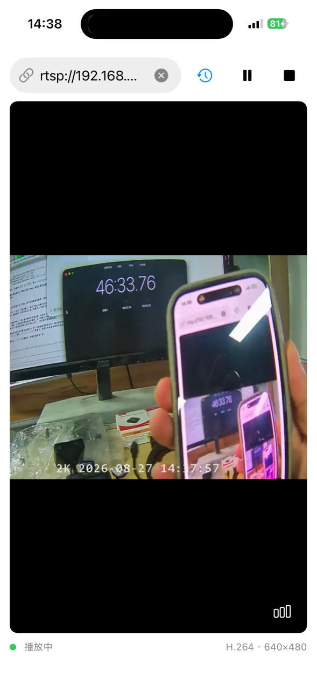

# RTSP Client

原生 RTSP 播放器,macOS 和 iOS 同一份代码。没有第三方依赖 —— RTSP 信令、
RTP 解包、H.264/H.265 组帧都是自己写的,只有硬解和上屏交给系统的
AVFoundation。



## 能做什么

- **播 RTSP 直播流**。默认地址 `rtsp://192.168.0.1/livestream/1/`,可以改。
- **UDP 优先,TCP 交织兜底**。摄像机那边往往只认一种,两条路都留着。
- **记住播过的地址**。编码、分辨率、播放次数都存下来,可以起备注名、可以收藏。
- **Digest / Basic 认证**。密码进钥匙串,不写进历史记录。
- **实时统计**。码率、帧率、已收字节、丢包数,叠在画面右上角。

不做音频。这个 App 只看画面,音频包在解包前就挡掉了 —— 不用为音视频同步
背额外的缓冲,延迟能压得更低。

## 环境

| 项 | 值 |
|---|---|
| macOS | 26.5+ |
| iOS | 26.5+ |
| Xcode | 26+ |
| Swift | 5.0 语言模式 |

## 跑起来

```sh
open RTSPClient.xcodeproj
```

选 `RTSPClient` scheme,`⌘R`。地址栏填 RTSP 地址,回车。

摄像机要认证的话会自己弹窗问,填过一次就记住了。

## 代码结构

```
RTSPClient/
├── Core/      RTSP 信令与传输：连接、消息、SDP、认证、会话状态机
├── Media/     RTP 解包与组帧：H.264 / H.265、时间线、丢包统计
├── Player/    对上层的门面：RTSPPlayer、渲染器、视频层
├── Storage/   播放历史（UserDefaults）与密码（钥匙串）
└── Views/     SwiftUI 界面：地址栏、历史列表、统计浮层
```

协议层不依赖 UI —— `RTSPSession` 可以单独用,测试驱动就是这么跑的。

细节在 [Docs/RTSPFlow.md](Docs/RTSPFlow.md):握手时序、传输协商、数据通路、
状态机、线程模型、延迟预算,九张交互图。

## 延迟

真机实测端到端约 250ms。其中渲染预缓冲 80ms 起,剩下的是摄像机编码 +
网络 + 解码上屏。

预缓冲是自适应的:从 80ms 开始,只有真的出现迟到帧才往上长(上限 400ms),
只长不缩。原因是带 B 帧的流在解码顺序里 PTS 不单调,乱序幅度可能超过 100ms,
固定 80ms 会顿;而大多数摄像机走 Baseline 不带 B 帧,不该让它们一直背着
高延迟。

## 存在哪

| 数据 | 位置 |
|---|---|
| 播放历史 | `UserDefaults` 键 `stream.history.v1`,最多 30 条 |
| 密码 | 钥匙串,service `com.iosdevlog.RTSPClient.stream` |

密码单独放钥匙串,标记 `kSecAttrAccessibleWhenUnlockedThisDeviceOnly` ——
不同步到 iCloud,不进备份,设备锁着读不出来。历史记录里只留用户名做提示。

## 测试

离线跑,不需要真摄像机。自带一个 RTSP 服务器,喂的是真实抓包里录下来的
RTP 数据。

```sh
Tests/build.sh      # 先编
Tests/unit.sh       # 单元测试
Tests/matrix.sh     # 会话层场景矩阵
Tests/player.sh     # 播放器层恢复路径
Tests/latency.sh    # 延迟 A/B 对照
Tests/docs.sh       # 校验文档里的 Mermaid 图
```

场景清单、基线数字、怎么重新采集抓包,看 [Tests/README.md](Tests/README.md)。

### 抓包

`Oraimo.pcap` 是 VLC 连那台真实摄像机时录的完整网络抓包,排查「连上了但
没画面」时用的。它是传输协商那套逻辑的依据 —— 摄像机只认
`RTP/AVP;unicast;client_port=...`,SETUP 里给交织请求换不来一个字节。

`Tests/Fixtures/oraimo_video.rtp` 就是从这份 pcap 里抽出来的视频 RTP 流,
换成测试服务器回放用的格式(4 字节大端长度 + 包体)。逐包比对过,480 个
包的 seq、时间戳、载荷全等。

两者的差别只在于 pcap 还留着 RTSP 握手和 SDP,fixture 只有 RTP。所以传输层
和信令层的疑问要翻 pcap,解包和渲染的疑问用 fixture 就够。

```sh
# tshark 在 Wireshark.app 里,/usr/bin/tshark 已经没有了
"/Applications/Wireshark.app/Contents/MacOS/tshark" -r Oraimo.pcap -Y rtsp
```

内容:UDP 传输,480 个 RTP 包 / 91 帧 / 3.6 秒。SDP 里
`profile-level-id=42001e`,码流内 SPS 一致,都是 Baseline —— 逐片解出
I×4 + P×87,没有 B 帧,RTP 时间戳零回退。所以这条流不乱序,预缓冲实际是在
吸收到达抖动:去掉时钟漂移后收齐时刻跨度 93.8ms,最大包间隔 127.4ms。

其余 fixture 是 ffmpeg 生成的,采集脚本在 `Tests/Fixtures/Capture/`。

